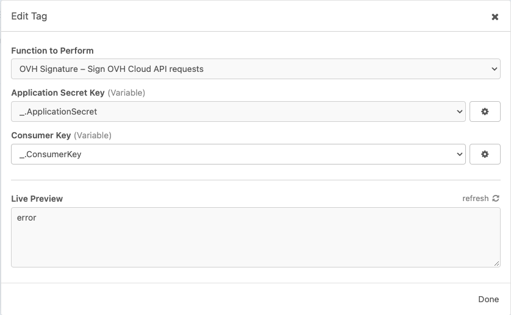

#  OVH Cloud API Signature for Insomnia

This is a plugin for [Insomnia](https://insomnia.rest/) that generates the `X-Ovh-Signature` signature header for API calls to the [OVH Cloud API](https://docs.ovh.com/gb/en/api/first-steps-with-ovh-api/#first-api-usage).

OVH Cloud API calls require that once you have obtained your three keys (AK, AS, CK), you need to sign all API requests. The signature is calculated as follows:

```
SHA1_HEX(AS+"+"+CK+"+"+METHOD+"+"+QUERY+"+"+BODY+"+"+TSTAMP)
```

##  Installation

Install the `insomnia-plugin-ovhcloud-signature` plugin from Preferences -> Plugins.

##  How to use

### Setup for OVH API Calls

[Generate your Application Keys](https://docs.ovh.com/gb/en/api/first-steps-with-ovh-api/#advanced-usage-pair-ovhcloud-apis-with-an-application_2). Once you have created the keys, you will be issued three keys:

- The Application Key, called AK
- The Application Secret, _not to be disclosed_, called AS
- The Secret Consumer Key, _not to be disclosed_, called CK

You will need to add your own headers for:

 - `X-Ovh-Application` with the value of the Application Key
 - `X-Ovh-Consumer` with the value of the Secret Consumer Key

You can template these in a private environment like:

```json
{
  "ApplicationKey": "1234567890abcdef",
  "ApplicationSecret": "1029384756abcdef",
  "ConsumerKey": "0987654321defabc"
}
```

Then using a plugin like the [Global Headers](https://insomnia.rest/plugins/insomnia-plugin-global-headers) you can set your _Base Environment_ to be something like:

```json
{
  "basePath": "https://api.ovh.com/1.0",
  "GLOBAL_HEADERS": {
    "Accept": "application/json",
    "Content-Type": "application/json;charset=utf-8",
    "X-Ovh-Application": "{{ApplicationKey}}",
    "X-Ovh-Consumer": "{{ConsumerKey}}"
  }
}
```

### Setup this plugin

Add the `OVH Signature` template tag to a request header.


Provide the values manually or from your private environment variables:



The plugin will generate and add the headers:

 - `X-Ovh-Timestamp`
 - `X-Ovh-Signature`
